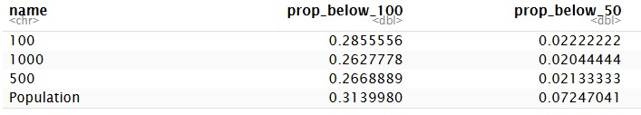

# Wetland samples

Now we go on to create the actual samples for ANO våtmark (wetlands), using `spaceR::nested_balanced_samples`.

We updated the sample in may 2026.

```{r setup_sample}
#| include: false
#| eval: true
#| message: false
#| error: false
library(tidyverse)
library(dbplyr)
library(DBI)
library(RPostgres)
library(dm)
#detach("package:spaceR", unload=TRUE)
#Sys.unsetenv("GITHUB_PAT")
#Sys.unsetenv("GITHUB_TOKEN")
#remotes::install_github("NINAnor/spaceR", force = T)
library(spaceR)
#?nested_balanced_samples

```

## Get and prepare sampling frame
First we need to fetch the sampling frame from the database.
```{r viewData}
#| include: true
#| eval: true
con <- DBI::dbConnect(drv = RPostgres::Postgres(), host = "t2lippgsql03", dbname = "ano_moduler")

pop <- dplyr::tbl(con, dbplyr::in_schema("sampling_frames", "samplingframe_vaatmark_2026")) |>
  dplyr::collect()

# helper to get a small subset of the data for testing
small <- function(data = pop) data |>  slice_sample(n = 10000)
```

This dataset (sampling frame) is `r nrow(pop)` long. @tbl-sf show just the first ten rows. We have two spreading variables: an easting `ost`, a northing `nord`. We also have sampling unit ID's in `ssbid`, and two auxiliary variable for balancing: `mean_slope` and `abi`. The stratification variable is called `region_ko` or `region_number`. We also need to create an `area` variable based on the sum of `r_hav` and `r_ferskvann`. 

```{r tbl-sf}
#| include: true
pop |>
  slice_head(n = 10) |>
  DT::datatable()
```

```{r datacheck}
#| eval: false
#| include: false
summary(pop$r_ferskvann)
summary(pop$r_hav)
wet_small <- small(pop)
dotchart(wet_small$r_ferskvann)
dotchart(wet_small$r_hav)
dotchart(wet_small$centroid_x)
dotchart(wet_small$centroid_y)
dotchart(wet_small$ost)
dotchart(wet_small$nord)

dotchart(wet_small$mean_slope)
dotchart(wet_small$abi)

```

```{r makeVars}
#| eval: true
pop <- pop |>
  rename(Northing = nord, Easting = ost) |>
  mutate(
    area = 100 - r_hav - r_ferskvann,
    stratum = as.character(region_number)
  )
```

There is one or a few cases of negative areas. I will just set those to be zeros.
```{r}
#| eval: true
# min(pop$area) #negative
# max(pop$area) #OK
pop <- pop |>
  mutate(area = case_when(
    area < 0 ~ 0,
    .default = area
  ))
```


```{r tbl-n}
#| eval: true
#| tbl-cap: 'Number of population units (SSB500 squares) in each strata.'
pop |>
  group_by(stratum) |>
  summarise(n = n())
```


There is a problem with `abi` that we have false zero values along the coast or along water. 
We know this from visual checks, but also from @fig-dots where we see that `abi` is always zero, 
at the same time that `r_bebygd_samf` is not.

```{r fig-dots}
#| eval: true
#| message: false
#| fig-cap: 'Distributions for selected variables for ABI is zero and r_bebygd_samf is not.' 
pop |>
  filter(abi == 0 & r_bebygd_samf > 0) |>
  pivot_longer(cols = c(r_hav, r_ferskvann, region_number, mean_slope, r_bebygd_samf, r_sno_isbre)) |>
  ggplot()+
  geom_dotplot(aes(value))+
  facet_wrap(.~name, scales = "free")+
  theme_bw()
```

Lets find these potentially erroneous ABI==0 cells and plot them on a map.

```{r}
# get ssb500 and join, then make it spatial
# for some reason dm::dm_from_con did work here, so I join manually
ssb500 <- dplyr::tbl(con, dbplyr::in_schema("ssb_grids", "ssb_500")) |>
  mutate(geom_wkb = dbplyr::sql("ST_AsBinary(geom)")) |>
  select(-geom) |>
  collect() |>
  mutate(geom = sf::st_as_sfc(geom_wkb, crs = 25833)) |>
  sf::st_as_sf(sf_column_name = "geom")

# join
ssb500_j <- ssb500 |>
  sf::st_drop_geometry() |>
  left_join(pop, by = join_by(ssbid))

# find problem cells and tag them
# plot using tmap interactive map


library(spdep)

# grid: your sf object
# columns: ABI and percentage_build_up_area

grid <- grid %>%
  mutate(
    problem = ABI == 0 & percentage_build_up_area > 0
  )

 # Find neighbouring cells:

nb <- poly2nb(grid, queen = TRUE)

#Impute each problem cell from the nearest neighbouring cell with ABI > 0:

impute_from_neighbour <- function(i, grid, nb) {
  neigh <- nb[[i]]

  # candidate neighbours with positive ABI
  candidates <- neigh[grid$ABI[neigh] > 0]

  if (length(candidates) == 0) {
    return(NA_real_)
  }

  # use the neighbour with the largest shared boundary / nearest centroid
  d <- st_distance(
    st_centroid(grid[i, ]),
    st_centroid(grid[candidates, ])
  )

  grid$ABI[candidates[which.min(d)]]
}

problem_ids <- which(grid$problem)

grid$ABI_imputed <- grid$ABI

grid$ABI_imputed[problem_ids] <- vapply(
  problem_ids,
  impute_from_neighbour,
  numeric(1),
  grid = grid,
  nb = nb
)

#Then keep track of which values were changed:

grid <- grid %>%
  mutate(
    ABI_was_imputed = problem & !is.na(ABI_imputed),
    ABI_final = if_else(ABI_was_imputed, ABI_imputed, ABI)
  )

#One caution: if a problem cell touches only other ABI == 0 cells, this leaves it as NA in ABI_imputed. That is usually safer than inventing a value. You can later run a second pass if needed.
```

Then let's set those ABI values to NA, and impute them from the nearest cell that has an ABI value. For this the data needs to be spatial.

<!-- library(terra)

# Problem cells
problem <- abi == 0 & bua > 0

# Convert zeros to NA
abi_na <- abi
abi_na[abi_na == 0] <- NA

# Fill using nearest non-NA value
abi_filled <- approxNA(abi_na, method="near")
# maybe there is a different method, like max?, that we can use.

# Replace only problematic cells
abi_final <- abi
abi_final[problem] <- abi_filled[problem] -->


## Sample
First we subset the columns, and run a test on 10 000 rows.
```{r stripdata}
#| eval: true

pop <- pop |>
  select(ssbid, Easting, Northing, area, abi, mean_slope, stratum) |>
    filter(stratum != 99)

wet_small <- small()
```

```{r test}
#| eval: true
testRun <- spaceR::nested_balanced(
  samplingFrame = wet_small,
  n_seq = seq(50, 20, -10),
  id_col = "ssbid",
  stratum_col = "stratum",
  easting_col = "Easting",
  northing_col = "Northing",
  area_col = "area",
  xbal_formula = ~ abi + mean_slope -1,
  exclude_offset = 1e+09,
  return_dataframe = TRUE,
  out_name = "testSample"
)
```


The test went fine, with no errors. 

The returned object `testRun` which is a list of lists. 
```{r testnames}
#| eval: true
names(testRun)
```

Then we try the same on the entire sampling population

```{r sampleAll}
#| eval: false
tictoc::tic()
wetlands <- spaceR::nested_balanced(
  samplingFrame = pop,
  n_seq = seq(1000, 10, -10),
  id_col = "ssbid",
  stratum_col = "stratum",
  easting_col = "Easting",
  northing_col = "Northing",
  area_col = "area",
  xbal_formula = ~ abi + mean_slope -1,
  exclude_offset = 1e+09,
  return_dataframe = FALSE,
  out_name = "wetlands1",
)
tictoc::toc()
# 1012.165 sec elapsed
#saveRDS(wetlands, "data/wetlands.rds")
```

Now I will combine all these lists of lists into something more manageable, like a dataframe.

```{r combinedata}
sample_names <- names(wetlands)
sample_sizes <- gsub("wetlands1_", "", sample_names) |> as.numeric()
all_ids <- wetlands$wetlands1_1000$ID

# Initialize empty matrix with NA
prob_matrix <- matrix(NA_real_, nrow = length(all_ids), ncol = length(sample_names),
                      dimnames = list(all_ids, sample_sizes))

# Fill in probabilities where IDs occur
for (i in seq_along(wetlands)) {
  w <- wetlands[[i]]
  id_match <- match(w$ID, all_ids)
  prob_matrix[id_match, i] <- w$prob
}

# create column with IDs
prob_matrix <-  prob_matrix |>
  as.data.frame() |>
  rownames_to_column("ssbid") |>
  as_tibble()

# append aux data
prob_matrix <- pop |>
  right_join(prob_matrix, by = join_by(ssbid))

head(prob_matrix)
```

In the code below I check that the proportion stay stable after the initial pps, and the do. Compared to the full population,
we have reduced the proportion of sampling units that have less then 100 or 50% or area by approx. 9 and 71%, respectively.

```{r}


prob_matrix |>
  select(ssbid, area, "1000", "500", "100") |>
  pivot_longer(cols = c("1000", "500", "100"),
               values_drop_na = TRUE) |>
  group_by(name) |>
  summarise(prop_below_100 = mean(area < 100, na.rm=T),
            prop_below_50 = mean(area < 50, na.rm=T)) |>
  rbind(
    pop |>
  summarise(prop_below_100 = mean(area < 100, na.rm=T),
            prop_below_50 = mean(area < 50, na.rm=T)) |>
    add_column("name" = "Population", .before = 1)
  ) |>
  kable()
```


## Evaluate balance

Here we should ideally evaluate the balance of the sample against a simple random sample, for example using `BalancedSampling::sb()`, but we don't have time to to this now unfortunately.

## Write to db

### Setup sample schema
This part sets up the schema, and is only done ones.

```{r}
schema_ur <- "CREATE SCHEMA samples"
dbSendQuery(con, schema_ur) 
```
Write queries to grant read only access to all.
```{r}
priv <- "ALTER DEFAULT PRIVILEGES IN SCHEMA samples GRANT SELECT ON TABLES TO ag_pgsql_ano_moduler_ro"
priv2 <- "ALTER DEFAULT PRIVILEGES IN SCHEMA samples GRANT SELECT ON TABLES TO ag_pgsql_ano_moduler_rw"
priv3 <- "ALTER DEFAULT PRIVILEGES IN SCHEMA samples GRANT SELECT ON TABLES TO ag_pgsql_ano_moduler_admin"
priv4 <- "GRANT USAGE ON SCHEMA samples  TO ag_pgsql_ano_moduler_admin"
priv5 <- "GRANT USAGE ON SCHEMA samples  TO ag_pgsql_ano_moduler_rw"
priv6 <- "GRANT USAGE ON SCHEMA samples  TO ag_pgsql_ano_moduler_ro"

dbSendStatement(con, priv)
dbSendStatement(con, priv2)
dbSendStatement(con, priv3)
dbSendStatement(con, priv4)
dbSendStatement(con, priv5)
dbSendStatement(con, priv6)
```

### Prepare and export

```{r}
myIDs <- uuid::UUIDgenerate(n = nrow(prob_matrix))
wetlands_db <- prob_matrix |>
  mutate(wetlands_sample_unit_id = myIDs,
         .after = 1) |>
  select(-Easting, -Northing, -area, -abi, -mean_slope, -stratum)

write_csv(wetlands_db, "data/wetland_samples_1000.csv")
```


```{r}
#| code-fold: true
q1 <- 'create table samples.vaatmark_2025 (
wetlands_sample_unit_ID varchar(50) PRIMARY KEY,
ssbid varchar(50),
  "1000" numeric(24,23),
   "990" numeric(24,23),
   "980" numeric(24,23),
   "970" numeric(24,23),
   "960" numeric(24,23),
   "950" numeric(24,23),
   "940" numeric(24,23),
   "930" numeric(24,23),
   "920" numeric(24,23),
   "910" numeric(24,23),
   "900" numeric(24,23),
   "890" numeric(24,23),
   "880" numeric(24,23),
   "870" numeric(24,23),
   "860" numeric(24,23),
   "850" numeric(24,23),
   "840" numeric(24,23),
   "830" numeric(24,23),
   "820" numeric(24,23),
   "810" numeric(24,23),
   "800" numeric(24,23),
   "790" numeric(24,23),
   "780" numeric(24,23),
   "770" numeric(24,23),
   "760" numeric(24,23),
   "750" numeric(24,23),
   "740" numeric(24,23),
   "730" numeric(24,23),
   "720" numeric(24,23),
   "710" numeric(24,23),
   "700" numeric(24,23),
   "690" numeric(24,23),
   "680" numeric(24,23),
   "670" numeric(24,23),
   "660" numeric(24,23),
   "650" numeric(24,23),
   "640" numeric(24,23),
   "630" numeric(24,23),
   "620" numeric(24,23),
   "610" numeric(24,23),
   "600" numeric(24,23),
   "590" numeric(24,23),
   "580" numeric(24,23),
   "570" numeric(24,23),
   "560" numeric(24,23),
   "550" numeric(24,23),
   "540" numeric(24,23),
   "530" numeric(24,23),
   "520" numeric(24,23),
   "510" numeric(24,23),
   "500" numeric(24,23),
   "490" numeric(24,23),
   "480" numeric(24,23),
   "470" numeric(24,23),
   "460" numeric(24,23),
   "450" numeric(24,23),
   "440" numeric(24,23),
   "430" numeric(24,23),
   "420" numeric(24,23),
   "410" numeric(24,23),
   "400" numeric(24,23),
   "390" numeric(24,23),
   "380" numeric(24,23),
   "370" numeric(24,23),
   "360" numeric(24,23),
   "350" numeric(24,23),
   "340" numeric(24,23),
   "330" numeric(24,23),
   "320" numeric(24,23),
   "310" numeric(24,23),
   "300" numeric(24,23),
   "290" numeric(24,23),
   "280" numeric(24,23),
   "270" numeric(24,23),
   "260" numeric(24,23),
   "250" numeric(24,23),
   "240" numeric(24,23),
   "230" numeric(24,23),
   "220" numeric(24,23),
   "210" numeric(24,23),
   "200" numeric(24,23),
   "190" numeric(24,23),
   "180" numeric(24,23),
   "170" numeric(24,23),
   "160" numeric(24,23),
   "150" numeric(24,23),
   "140" numeric(24,23),
   "130" numeric(24,23),
   "120" numeric(24,23),
   "110" numeric(24,23),
   "100" numeric(24,23),
   "90" numeric(24,23),
   "80" numeric(24,23),
   "70" numeric(24,23),
   "60" numeric(24,23),
   "50" numeric(24,23),
   "40" numeric(24,23),
   "30" numeric(24,23),
   "20" numeric(24,23),
   "10" numeric(24,23),
  CONSTRAINT fk_vaatmark_ssbid
    FOREIGN KEY (ssbid)
      REFERENCES ssb_grids.ssb_500 (ssbid)
    DEFERRABLE INITIALLY DEFERRED
);'


```

```{r}
# indices makes the database work faster. It should be added to all tables that are looked up frequently
q2 <- "create index on samples.vaatmark_2025 using btree(ssbid);"
q3 <- "create index on samples.vaatmark_2025 using btree(wetlands_sample_unit_ID);"
```


```{r}
# sending the queries:
dbSendStatement(con, q1)
dbSendStatement(con, q2)
dbSendStatement(con, q3)
```

```{r}
write_sf(wetlands_db, dsn = con,
         layer = Id(schema = "samples", table = "vaatmark_2025"), 
         append = T)
```

Testing that the data is there:

```{r}
#| eval: true
dplyr::tbl(con, dbplyr::in_schema("samples", "vaatmark_2025")) |>
  #dplyr::slice(n = 8) |>
  select(ssbid, "1000", "500", "100")
```


