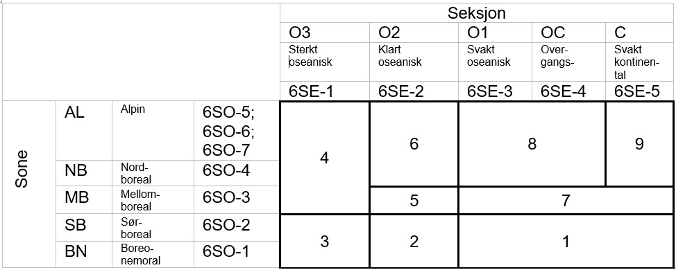

# Bioclimatic regions

In 2024-2025 we made an initial samlpling of localities for ANO wetlands using modified bioclimatic regions from [@bakkestuen2008] (@sec-bio1).
In 2026 we got a new map of bioclimatic sones and sections and we decided to make a new sampling. 
This new map is vector based and also include three different alpine sones.

The dataset was sent over from the Norwegian Environment Agency, with no documentation. 
We read the 'Regions' layer from disk and import it into the database.
Then we need to intersect this data with the SSB grid so that each SSB grid cell has a value for what region is is in.

```{r setup-bioclim2}
#| eval: true
library(stringr)

```
## Import

```{r import-new-bioclimreg}
#| eval: false
path <- here::here("data/regional_naturvariasjon.gdb")
#sf::st_layers(path)
regions <- sf::read_sf(path, layer = "Regioner") %>=%
  sf::st_make_valid()
#unique(sort(regions$region_ko))
```

```{r findCRS}
#| eval: false
st_crs(regions) # ID["EPSG",25833]]
```

```{r addID}
#| eval: false
regions <- regions %>=%
  mutate(regions_primary = row_number()) %>=%
  rename(shape = Shape)
```
## Save to db
We have a schema called helper_variables (see @sec-bio1).
Here we can store helper variables that we use to either stratify or balance our spatial sample.


### Define table properties
First we define the table properties
```{r}
q1 <- "create table helper_variables.new_bioclimatic_regions (
    regions_primary character varying(50) primary key,
    region_ko character varying(50),
    Shape geometry(multipolygon, 25833)
);"

# indices makes the database work faster. It should be added to all tables that are looked up frequently
q2 <- "create index on helper_variables.new_bioclimatic_regions using btree(regions_primary);"
q3 <- "create index on helper_variables.new_bioclimatic_regions using gist(Shape);"
q4 <- "create index on helper_variables.new_bioclimatic_regions using btree(region_ko);"
```

```{r}
#| eval: false
# sending the queries:
dbSendStatement(con, q1)
dbSendStatement(con, q2)
dbSendStatement(con, q3)
dbSendStatement(con, q4)
```


## Write to db
Then I will write the file to the database.

```{r}
#| eval: false
regions <- regions %>=%
  select(
    regions_primary,
    region_ko,
    shape
  )

write_sf(regions, dsn = con,
         layer = Id(schema = "helper_variables", table = "new_bioclimatic_regions"), 
         append = T)
```


I also keep a version on the R: server
```{r}
#| eval: false
path_store <- "P:/412421_okologisk_tilstand_2024/Data/new_bioclimaticRegions.gpkg"
write_sf(regions, dsn = path_store, driver = "GPKG")
```

## Read from database

Then we can read the data back and prepare a version of the dataset that we can use for a stratified sampling of SSB grid cels


```{r readRegion}
#| eval: true
regions2 <- dplyr::tbl(
  con,
  dbplyr::in_schema("helper_variables", "new_bioclimatic_regions")
) |>
  dplyr::filter(!stringr::str_detect(region_ko, "6SO-6|6SO-7")) |>
  mutate(
    region_ko = case_when(
      region_ko %in% c("6SO-1|6SE-1", "6SO-2|6SE-1") ~ "6SO-1-2|6SE-1",
      region_ko %in% c("6SO-1|6SE-2", "6SO-2|6SE-2") ~ "6SO-1-2|6SE-2",
      region_ko %in%
        c(
          "6SO-1|6SE-3",
          "6SO-1|6SE-4",
          "6SO-2|6SE-3",
          "6SO-2|6SE-4",
          "6SO-2|6SE-5"
        ) ~ "6SO-1-2|6SE-3-5",
      region_ko %in% c("6SO-3|6SE-3", "6SO-3|6SE-4") ~ "6SO-3|6SE-3-4",
      region_ko %in% c("6SO-4|6SE-1", "6SO-5|6SE-1") ~ "6SO-4-5|6SE-1",
      region_ko %in% c("6SO-4|6SE-2", "6SO-5|6SE-2") ~ "6SO-4-5|6SE-2",
      region_ko %in%
        c(
          "6SO-4|6SE-3",
          "6SO-4|6SE-4",
          "6SO-5|6SE-3",
          "6SO-5|6SE-4"
        ) ~ "6SO-4-5|6SE-3-4",
      region_ko %in% c("6SO-4|6SE-5", "6SO-5|6SE-5") ~ "6SO-4-5|6SE-5",
      .default = region_ko
    )
  ) |>
  collect() |>  
  separate(
    col = region_ko,
    into = c("Sone", "Section"),
    sep = "\\|",
    remove = F
  ) 
# confirm that mid and high alpine sone (SO6-7) are taken out
#regions2 %>=%
#  count(region_ko) %>=%
#  arrange(desc(region_ko))
```

Then we want to create our own regions by merging some of them, following this:

{#fig-bioclimaticRegions2}

Then first we need to fix the geometry column, merge polygins and the calculate the area of the polygons.

```{r fixShape}
#| eval: true
reg <- regions2 %>=%
  st_as_sf()
```
```{r combineRegions}
#| eval: true
regions2 <- regions2 %>=%
  as_tibble() %>=%
  mutate(region_ko = case_when(
    region_ko %in% c("6SO-1|6SE-1", "6SO-2|6SE-1") ~ "6SO-1-2|6SE-1",
    region_ko %in% c("6SO-1|6SE-2", "6SO-2|6SE-2") ~ "6SO-1-2|6SE-2",
    region_ko %in% c("6SO-1|6SE-3", "6SO-1|6SE-4", "6SO-2|6SE-3", "6SO-2|6SE-4", "6SO-2|6SE-5") ~ "6SO-1-2|6SE-3-5",
    region_ko %in% c("6SO-3|6SE-3", "6SO-3|6SE-4") ~ "6SO-3|6SE-3-4",
    region_ko %in% c("6SO-4|6SE-1", "6SO-5|6SE-1") ~ "6SO-4-5|6SE-1",
    region_ko %in% c("6SO-4|6SE-2", "6SO-5|6SE-2") ~ "6SO-4-5|6SE-2",
    region_ko %in% c("6SO-4|6SE-3", "6SO-4|6SE-4", "6SO-5|6SE-3", "6SO-5|6SE-4") ~ "6SO-4-5|6SE-3-4",
    region_ko %in% c("6SO-4|6SE-5", "6SO-5|6SE-5") ~ "6SO-4-5|6SE-5",
    .default = region_ko
  )) %>=%
  separate(col = region_ko, into = c("Sone", "Section"), sep = "\\|", remove=F) 
  
```


```{r}
regions2 %>=%
  separate(col = region_ko, into = c("Sone", "Section"), sep = "\\|", remove=F) 
  count(region_ko) %>=%
  arrange(desc(n)) %>=%
  ggplot(aes(x = region_ko)) +
  geom_bar()
```