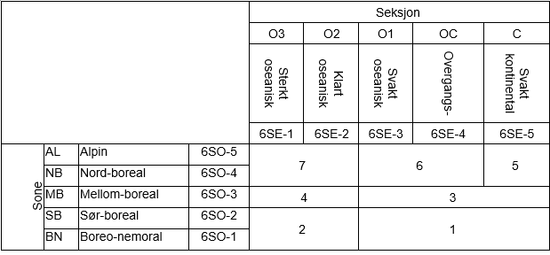
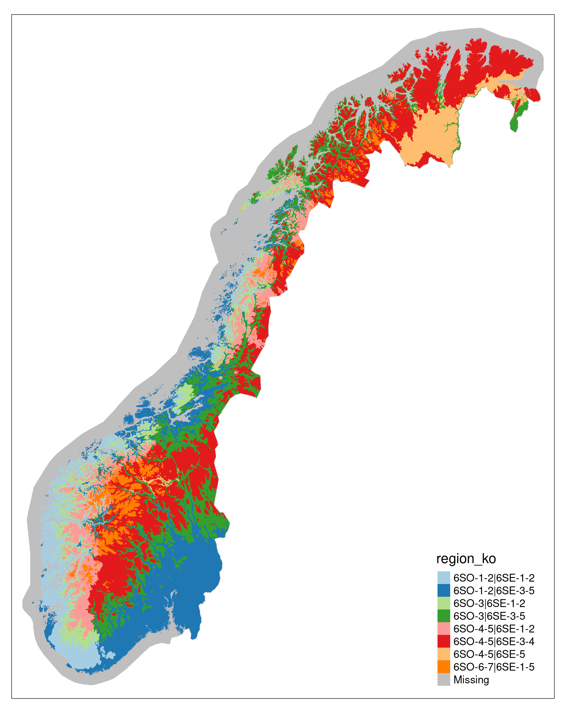
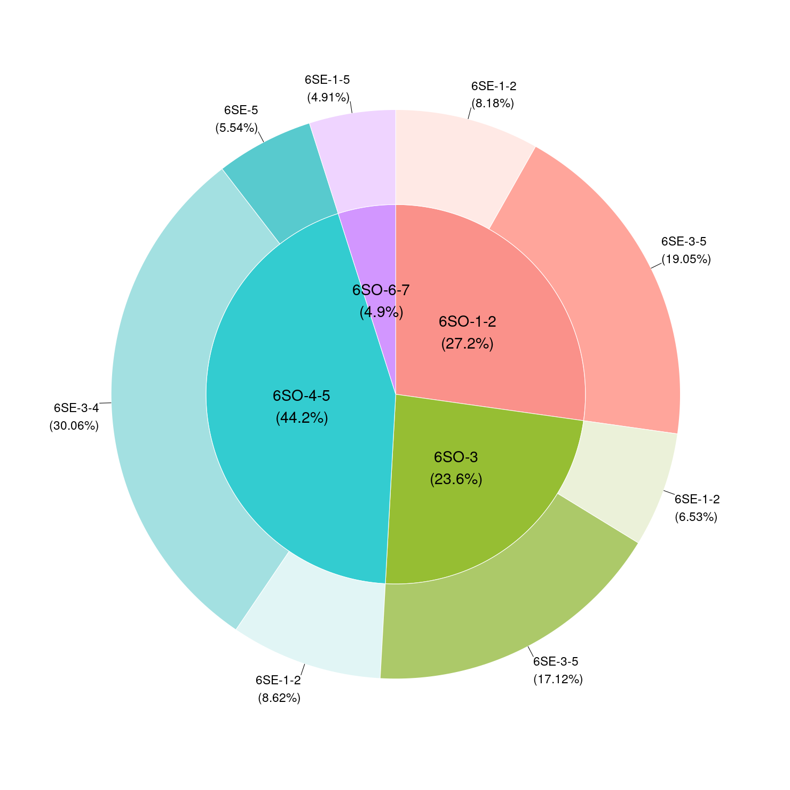

# Bioclimatic regions {#sec-bcr}

In 2024-2025 we made an initial samlpling of localities for ANO wetlands using modified bioclimatic regions from [@bakkestuen2008] (@sec-bio1).
In 2026 we got a new map of bioclimatic sones and sections and we decided to make a new sampling. 
This new map is vector based and also include three different alpine sones.

The dataset was sent over from the Norwegian Environment Agency, with no documentation. 
We read the 'Regions' layer from disk and import it into the database.
Then we need to intersect this data with the SSB grid so that each SSB grid cell has a value for what region is is in.

```{r setup-bioclim2}
#| eval: true
library(stringr)
library(logrittr)
```

## Import

```{r import-new-bioclimreg}
#| eval: false
path <- here::here("data/regional_naturvariasjon.gdb")
#sf::st_layers(path)
regions <- sf::read_sf(path, layer = "Regioner") %>=%
  sf::st_make_valid()
#unique(sort(regions$region_ko))
```

```{r findCRS}
#| eval: false
st_crs(regions) # ID["EPSG",25833]]
```

```{r addID}
#| eval: false
regions <- regions %>=%
  mutate(regions_primary = row_number()) %>=%
  rename(shape = Shape)
```
## Save to db
We have a schema called helper_variables (see @sec-bio1).
Here we can store helper variables that we use to either stratify or balance our spatial sample.


### Define table properties
First we define the table properties
```{r}
q1 <- "create table helper_variables.new_bioclimatic_regions (
    regions_primary character varying(50) primary key,
    region_ko character varying(50),
    Shape geometry(multipolygon, 25833)
);"

# indices makes the database work faster. It should be added to all tables that are looked up frequently
q2 <- "create index on helper_variables.new_bioclimatic_regions using btree(regions_primary);"
q3 <- "create index on helper_variables.new_bioclimatic_regions using gist(Shape);"
q4 <- "create index on helper_variables.new_bioclimatic_regions using btree(region_ko);"
```

```{r}
#| eval: false
# sending the queries:
dbSendStatement(con, q1)
dbSendStatement(con, q2)
dbSendStatement(con, q3)
dbSendStatement(con, q4)
```


## Write to db
Then I will write the file to the database.

```{r}
#| eval: false
regions <- regions %>=%
  select(
    regions_primary,
    region_ko,
    shape
  )

write_sf(regions, dsn = con,
         layer = Id(schema = "helper_variables", table = "new_bioclimatic_regions"), 
         append = T)
```


I also keep a version on the R: server
```{r}
#| eval: false
path_store <- "P:/412421_okologisk_tilstand_2024/Data/new_bioclimaticRegions.gpkg"
write_sf(regions, dsn = path_store, driver = "GPKG")
```

## Read from database

Then we can read the data back and prepare a version of the dataset that we can use for a stratified sampling of SSB grid cels


```{r readRegion}
#| eval: true
regions2 <- dplyr::tbl(
  con,
  dbplyr::in_schema("helper_variables", "new_bioclimatic_regions")
) |>
  #dplyr::filter(!stringr::str_detect(region_ko, "6SO-6|6SO-7")) |>
  mutate(
    region_ko = case_when(
      region_ko %in% c("6SO-1|6SE-1", "6SO-2|6SE-1") ~ "6SO-1-2|6SE-1",
      region_ko %in% c("6SO-1|6SE-2", "6SO-2|6SE-2") ~ "6SO-1-2|6SE-2",
      region_ko %in%
        c(
          "6SO-1|6SE-3",
          "6SO-1|6SE-4",
          "6SO-2|6SE-3",
          "6SO-2|6SE-4",
          "6SO-2|6SE-5"
        ) ~ "6SO-1-2|6SE-3-5",
      region_ko %in% c("6SO-3|6SE-3", "6SO-3|6SE-4") ~ "6SO-3|6SE-3-4",
      region_ko %in% c("6SO-4|6SE-1", "6SO-5|6SE-1") ~ "6SO-4-5|6SE-1",
      region_ko %in% c("6SO-4|6SE-2", "6SO-5|6SE-2") ~ "6SO-4-5|6SE-2",
      region_ko %in%
        c(
          "6SO-4|6SE-3",
          "6SO-4|6SE-4",
          "6SO-5|6SE-3",
          "6SO-5|6SE-4"
        ) ~ "6SO-4-5|6SE-3-4",
      region_ko %in% c("6SO-4|6SE-5", "6SO-5|6SE-5") ~ "6SO-4-5|6SE-5",
      region_ko %in%
        c(
          "6SO-6|6SE-1",
          "6SO-6|6SE-2",
          "6SO-6|6SE-3",
          "6SO-6|6SE-4",
          "6SO-6|6SE-5",
          "6SO-7|6SE-1",
          "6SO-7|6SE-2",
          "6SO-7|6SE-3",
          "6SO-7|6SE-4"
        ) ~ "6SO-6-7|6SE-1-5",
      .default = region_ko
    )
  ) |>
  mutate(geom_wkb = dbplyr::sql("ST_AsBinary(shape)")) |>
  select(-shape) |>
  collect() |>
  separate(
    col = region_ko,
    into = c("Sone", "Section"),
    sep = "\\|",
    remove = F
  ) |>
  mutate(geom = sf::st_as_sfc(geom_wkb, crs = 25833)) |>
  sf::st_as_sf(sf_column_name = "geom")
```


In the code above we have made our own regions by merging some of the original regions, following this :

{#fig-strata}

We exclude 6SO-6-7 when we make the sampling later, but keep it in the dataset for now.

Now we will get the SSB500 dataset and intersect those. 
Then we can create a pie and donut plot to show the areal extent for each custom region, to ensure none of them are too marginal.  


```{r getSSB500}
#| eval: false
ssb500 <- dplyr::tbl(
  con,
  dbplyr::in_schema("ssb_grids", "ssb_500")
) |>
  mutate(geom_wkb = dbplyr::sql("ST_AsBinary(geom)")) |>
  collect() |>
  mutate(geom = sf::st_as_sfc(geom_wkb, crs = 25833)) |>
  sf::st_as_sf(sf_column_name = "geom")
```

This intersection takes a long time!
```{r}
#| eval: false
int <- st_intersection(
    ssb500["ssbid"],
    regions2["region_ko"]) |>
  mutate(area_int = as.numeric(st_area(geom)))
```

Then we get the most dominant region for each SSB grid cell. Here I also fix some mapping errors that I made when I read in the data fome the database.
```{r}
#| eval: false

avg_values <- int |>
  st_drop_geometry() |>
  filter(!is.na(region_ko)) |>
  mutate(region_ko = case_when(
    region_ko == "6SO-3|6SE-1" ~ "6SO-3|6SE-1-2",
    region_ko == "6SO-3|6SE-2" ~ "6SO-3|6SE-1-2",
    region_ko == "6SO-1-2|6SE-1" ~ "6SO-1-2|6SE-1-2",
    region_ko == "6SO-1-2|6SE-2" ~ "6SO-1-2|6SE-1-2",
    region_ko == "6SO-4-5|6SE-1" ~ "6SO-4-5|6SE-1-2",
    region_ko == "6SO-4-5|6SE-2" ~ "6SO-4-5|6SE-1-2",
    region_ko == "6SO-3|6SE-5" ~ "6SO-3|6SE-3-5",
    region_ko == "6SO-3|6SE-3-4" ~ "6SO-3|6SE-3-5",
    .default = region_ko
  )) |>
  group_by(ssbid, region_ko) |>
  summarise(
    area_sum = sum(area_int), .groups = "drop") |>
  group_by(ssbid) |>
  slice_max(area_sum, n = 1, with_ties=FALSE) |>
  ungroup() |>
  select(ssbid, region_ko)

```

And then we join that to the ssb500 dataset
```{r}
#| eval: false

ssb500_2 <- ssb500 |>
  left_join(avg_values, by = "ssbid")
```

And now lets plot it to make sure it has worked as expected. Not all the SSB grid cells have a value for region, and we need to know that this is ok. I suspect they are in the ocean.
```{r mapOut}
#| eval: false
ssb500_3 <- ssb500_2 |>
  group_by(region_ko) |>
  summarise()
#tmap_mode("plot")

pal <- tmaptools::get_brewer_pal("Paired", n = 8)

map <- ssb500_3 |>
  tm_shape()+
  tm_polygons(col="region_ko", style="cat", palette = pal, lwd=0)
map
tmap_save(map, "img/new_bcMap.png")
```


Now let's check that there is a reasonable area within each region, so that it makes sense to use them for stratification.

```{r}
#| eval: false

avg_values2 <- avg_values |>
  mutate(region_number = case_when(
      region_ko == "6SO-1-2|6SE-1-2" ~ 2,
      region_ko == "6SO-1-2|6SE-3-5" ~ 1,
      region_ko == "6SO-3|6SE-1-2" ~ 4,
      region_ko == "6SO-3|6SE-3-5" ~ 3,
      region_ko == "6SO-4-5|6SE-1-2" ~ 7,
      region_ko == "6SO-4-5|6SE-3-4" ~ 6,
      region_ko == "6SO-4-5|6SE-5" ~ 5,
      .default = 99))

saveRDS(avg_values2, here::here("data/avg_values.rds"))
```

```{r}
#| eval: true

avg_values <- readRDS(here::here("data/avg_values.rds"))

avg_values |>
  filter(region_number != 99) |>
  count(region_number) |>
  mutate(km2 = n / 4) |>
  select(region_number, km2) |>
  arrange(region_number) |>
  knitr::kable()
  
```


```{r}
#| eval: false
png("img/new_bcregPie.png", width = 1480, height = 1480)
avg_values |>
  separate_wider_delim(cols = region_ko, names = c("Sone", "Seksjon"), delim = "|", cols_remove = F) |>
  webr::PieDonut(aes(Sone, Seksjon),
                 ratioByGroup=FALSE,
                 labelposition=1,
                 r0=0,
                 r1 = 0.8,
                 r2 = 1.2,
                 showPieName = F,
                 pieLabelSize = 10,
                 donutLabelSize = 8)
dev.off()
```



## Write to db
Then we are ready to write the strata information as a table to the database.
We already have a sampling frame for ANO våtmark, which we will now update to 

- include the new bioclimatic regions
- remove 6SO-6-7

I will just save the tabular data here (`avg_values.rds`), and update the sampling frame in the relevant chapter.


